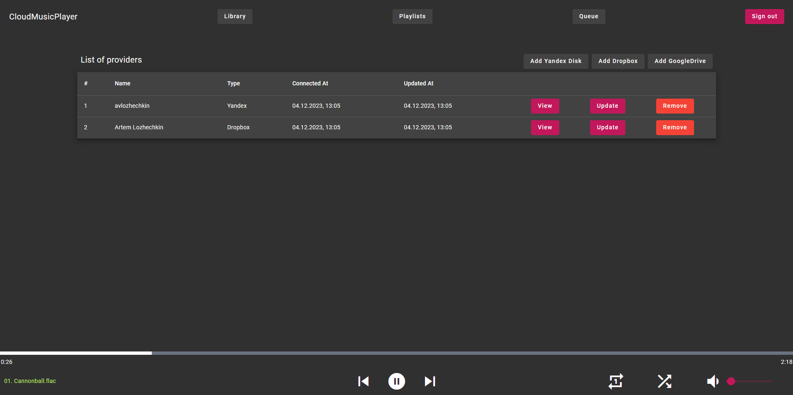
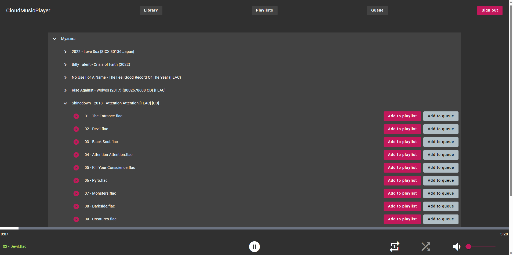
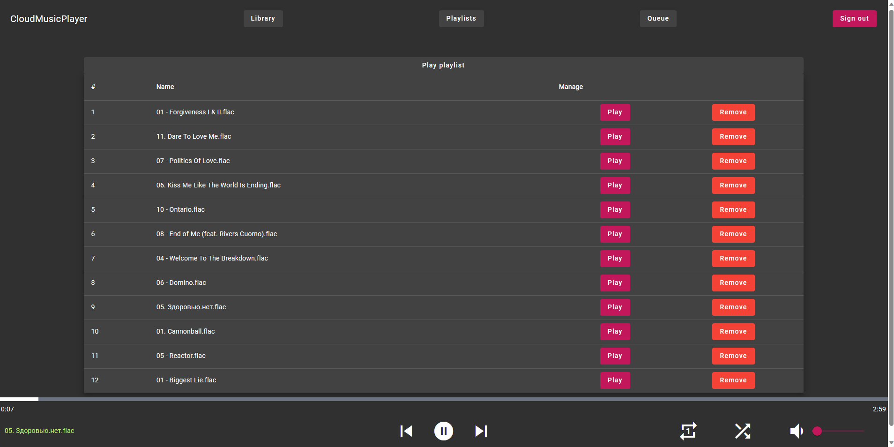

# CloudTunes

ASP.NET Core + Angular music player for music from Yandex.Disk/Dropbox (and Google Drive later)

# О проекте

- Идея проекта заключается в разработке веб-приложения, которое будет представлять собой музыкальный плеер для прослушивания музыки с Яндекс.Диска и Dropbox (в дальнейшем планирую добавить поддержку GoogleDrive). К примеру, пользователь загружает на один из доступных провайдеров (Яндекс.Диск, например) различные музыкальные файлы и в дальнейшем он сможет слушать их напрямую из браузера, а также собирать плейлисты, в т.ч. с музыкой из различных провайдеров (например, половина песен из Яндекс.Диска и половина из Dropbox)

# Статус проекта

- Ну относительно работает. Есть воспроизведение музыки, очередь, плейлисты и отображение дерева файлов.
- На фронте миллиард неучтенных сценариев, которые надо доделывать.
- ~~В данный момент на бэке сервисы покрыты юнит-тестами на 100%, в дальнейшем предполагается поддержание полного покрытия тестами.~~

- Пока что тесты отменяются, так как требования к проекту генерируются в режиме реального времени.
- Есть возможность локального запуска без Postgres и Redis (заменяется на SQLite и InMemoryCache)
- Добавлен простой сбор метрик (Prometheus и экспортеры для Redis/Postgres/API/Node/Nginx), но требуется более детальная настройка.
- Настроен docker-compose и Nginx в качестве reverse-proxy для доступа к API/Seq/Grafana/Prometheus.

# Проект в картинках

Вот так выглядит страница провайдеров, доступная после регистрации.
Здесь пользователь может добавлять разные источники данных (провайдеры) - Яндекс.Диск, Dropbox и (чуть позже будет добавлен) Google Drive при помощи OAuth.
На картинке представлен профиль пользователя, у которого добавлены Яндекс.Диск и Dropbox.

Это страница самого провайдера, в которую можно попасть через кнопку View на странице провайдеров. Здесь представлено дерево файлов из подключенного провайдера. Каждую песню можно либо запустить как отдельную, либо добавить в плейлист или очередь проигрывания.

Это страница одного из плейлистов. Сюда можно добавлять музыку из провайдера и запускать её одновременно, т.е. здесь можно переключаться между предыдущими и прошлыми треками, а также указывать режим воспроизведение - повторять одну песню, повторять все песни из плейлиста и не повторять вообще. Ещё есть шаффлинг песен.

