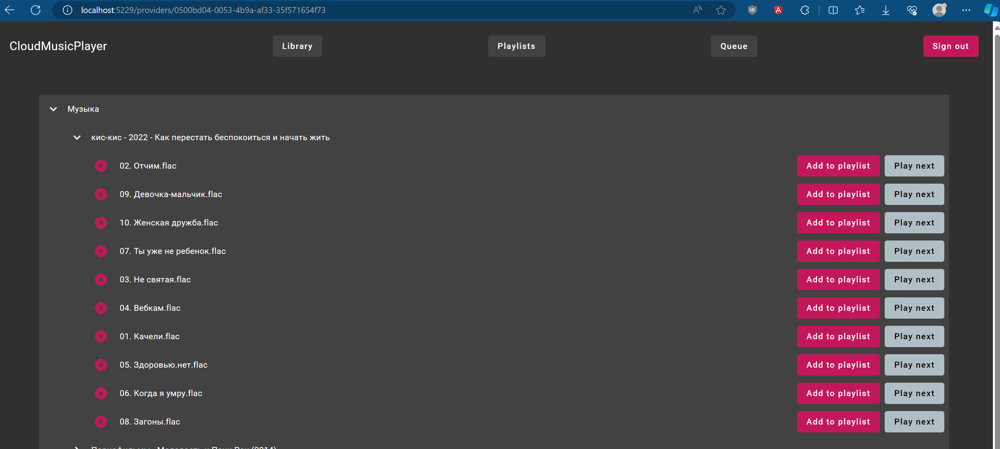
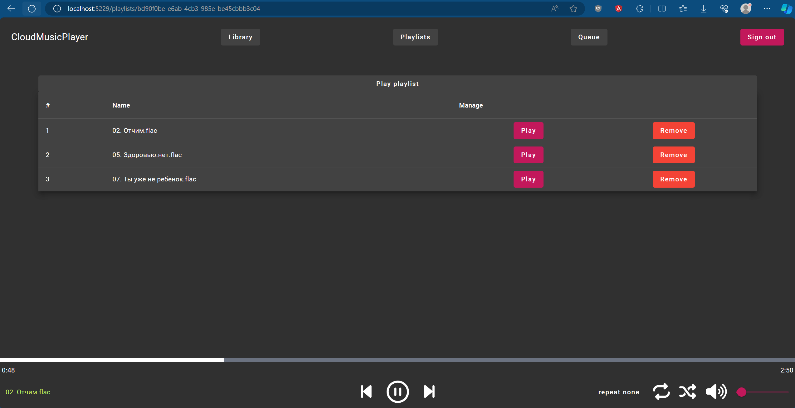

# CloudMusicPlayer

ASP.NET Core + Angular music player for music from Yandex.Disk (and Google Drive/Dropbox later)

# О проекте

- Цель проекта - изучение и отработка навыков стека ASP.NET Core + Angular + Entity Framework Core.
- Идея проекта заключается в разработке веб-приложения, которое будет представлять собой музыкальный плеер для прослушивания музыки с Яндекс.Диска (в дальнейшем планирую добавить поддержку GoogleDrive и Dropbox) с поддержкой плейлистов и очередей.
- В конечном итоге планируется развертывание веб-приложения при помощи Terraform как Serverless Container в Яндекс.Облако, но до этого ещё далеко.

# Статус проекта

- На фронте миллиард неучтенных сценариев, которые надо доделывать.
- Идет проработка предметной области, код в CloudMusicPlayer.API очень сырой, так как вся работа идёт в проектах CloudMusicPlayer.Core, CloudMusicPlayer.Infrastructure, а также в папке frontend.
- В данный момент на бэке сервисы покрыты юнит-тестами на 100%, в дальнейшем предполагается поддержание полного покрытия тестами.

# Проект в картинках

Вот так выглядит страница провайдеров, доступная после регистрации. Здесь пользователь может добавлять разные источники данных (провайдеры) - Яндекс.Диск (пока только он доступен), Dropbox и Google Drive при помощи OAuth.

Это страница самого провайдера, в которую можно попасть через кнопку View на странице провайдеров. Здесь представлено дерево файлов из подключенного провайдера. Каждую песню можно либо запустить как отдельную, либо добавить в плейлист.

Это страница одного из плейлистов. Сюда можно добавлять музыку из провайдера и запускать её одновременно, т.е. здесь можно переключаться между предыдущими и прошлыми треками, а также указывать режим воспроизведение - повторять одну песню, повторять все песни из плейлиста и не повторять вообще.

